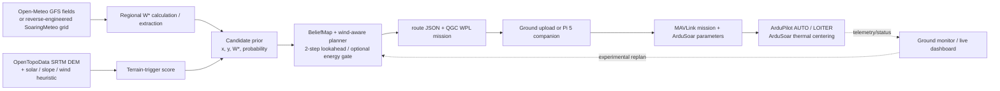

# Mainline Technical-Support Review

**Mainline:** weather → planner → companion / ground monitor → MAVLink → ArduPilot / ArduSoar
**Review date:** 2026-07-28
**Reviewed baseline:** `bde3a3f3b5631b32e0e419bac15ee0c119d83fcc` plus the explicitly listed fixes made during this review
**Decision labels:** Verified · Partially Verified · Suspected AI Hallucination · Refuted

## 1. Bottom Line

The repository contains a real, testable prototype, not fabricated code. Its offline weather processing, planner geometry, wind-aware reachability, route serialization, energy gate, terrain scoring primitives, belief lifecycle, and replan transformations have executable unit coverage. All 95 current tests pass, including three live network integrations.

The complete operational claim is not yet technically supported. The evidence currently supports:

> Real forecast/model inputs can be converted into heuristic lift opportunity scores and then into an ArduPilot-compatible candidate mission.

It does **not** yet support:

> The system predicts the geographic locations of real thermals, safely closes the weather-to-ArduSoar loop, or improves endurance/cross-country performance on a real aircraft.

The largest evidence gap is not code volume; it is provenance and validation. Several documentation statements promote model grid points, random samples, or terrain heuristics into “forecast thermal locations.” The SITL “weather truth” demo then injects simulated lift at those planned points, making the result circular. There is also no retained SITL telemetry, DataFlash log, Pi 5 bench trace, hardware-in-the-loop record, or real-flight log in this checkout.

Current overall classification: **Partially Verified prototype; not flight-validated.**

## 2. Reviewed Scope

The review covered the full active mainline and its directly supporting documentation/tests:

- Weather: `weather/*.py`, `weather/README.md`, live Open-Meteo and SoaringMeteo adapters, terrain prior, cached-data behavior.
- Planning: `planner/*.py`, `navigation/thermal_prior.py`, energy model, mission writers, vision/replan path.
- Companion: `companion/mav.py`, upload/runtime/monitor programs, guided and cross-country variants, Pi 5 instructions.
- ArduPilot handoff: QGC WPL output, mission/command/parameter protocols, ArduSoar parameter files.
- SITL/dashboard: mainline-facing drivers, live dashboard, setup and demo scripts, claimed validation evidence.
- Tests: all files under `tests/`.

Deleted `goals.md` and `proposal.md` were not used as evidence and were not restored.

## 3. Mainline as Implemented

Solid arrows are implemented data paths. Dashed arrows are incomplete experimental feedback paths, not a validated autonomous closed loop.

## 4. Evidence Produced in This Review

| Check | Result | What it proves | What it does not prove |
|---|---:|---|---|
| `python -m compileall -q weather planner navigation companion sitl dashboard` | Pass | Python syntax/import-independent compilation | Runtime availability of optional packages or hardware |
| `pytest tests -q -m "not integration"` | **92 passed, 3 deselected** | Offline algorithms and regression suite | Live services, SITL, MAVLink, Pi, FC |
| `pytest tests -q -m integration` | **3 passed, 90 deselected** | Open-Meteo and current SoaringMeteo endpoints/parsers returned plausible data on 2026-07-28 | Forecast accuracy or thermal-core location accuracy |
| `pytest tests -q` | **95 passed** | Combined current test suite | End-to-end flight |
| Dependency probe in `.venv` | `pymavlink=False`, `dash=False`, `plotly=False` | Current test venv cannot run companion/live dashboard directly | Installation from the documented requirement files |
| WSL/SITL probe | WSL not installed | SITL cannot be run on this computer in the current state | SITL behavior on another configured computer |
| Artifact search | No `.tlog`, `.BIN`, or flight log | No replayable flight evidence is retained here | Whether an unrecorded demo happened elsewhere |
| Hardware evidence | None supplied | — | FC, Pi 5 UART, airframe, sensor, or flight safety |
| Reference-PDF review | 22-page AutoSOAR paper and 10-page POMDSoar paper read in full; key architecture, algorithm, parameter, and result pages visually checked | The requirements and constants stated by the two papers | Whether this repository implements or validates them |

The test suite is meaningful, but most tests are unit-level. The three integration tests validate data access and sanity ranges only.

Both PDFs under `docs/` were treated as primary sources and checked read-only:

- Depenbusch, Bird, and Langelaan, *The AutoSOAR autonomous soaring aircraft, part 1: Autonomy algorithms*, Journal of Field Robotics 35 (2018), 868–889, DOI 10.1002/rob.21782.
- Guilliard, Rogahn, Piavis, and Kolobov, *Autonomous Thermalling as a Partially Observable Markov Decision Process* (POMDSoar).

## 5. Compliance with the Two Reference Papers

### 5.1 Scope distinction

The papers describe different layers:

- **AutoSOAR** is a complete onboard autonomy stack: measured aircraft polar, energy/wind estimation, a dynamic mean/variance atmospheric map, lift-feature and persistent occupancy maps, probabilistic glide footprint, speed-to-fly, thermal centering, and an explore/exploit finite-state machine.
- **POMDSoar** is a tactical controller used *after a thermal has been detected*. It reuses ArduSoar's thermal EKF and entry/exit logic, but replaces fixed-radius centering with a roughly 1 Hz POMDP/MPC action selector. Thermal detection, thermal exit, and cross-country thermal finding are outside that paper's scope.
- This repository is primarily a **pre-flight strategic weather prior and route generator** that delegates tactical centering to stock ArduSoar. Therefore, resemblance to either paper does not by itself establish implementation conformance.

### 5.2 AutoSOAR compliance matrix

| AutoSOAR requirement | Repository evidence | Verdict |
|---|---|---|
| Aircraft-specific speed polar measured from flight data; banked-turn sink derived from it (Section 3.1, Equations 1–2). | `SOAR_POLAR_CD0/B/K` and fixed sink assumptions exist, but no retained polar measurements or fit. The “Radian-class” triplet is not established by either supplied paper. | **Partially Verified structure; values unsupported** |
| Energy-state UKF and horizontal/vertical wind estimates with propagated variance (Sections 3.2.1–3.2.2, Equations 3–12). | No corresponding UKF, specific-energy state, motor-state exclusion, or uncertainty propagation exists in the reviewed mainline. `VFR_HUD.climb` is consumed directly. | **Refuted as an AutoSOAR implementation** |
| Uniform 2-D atmospheric mean/variance grid; 10 Hz measurements, 1 Hz prediction; gust/sensor/localization variance and 50 m spatial spreading (Section 3.3, Equations 13–15). | `companion/ground_monitor.py:48–98` has a sparse latitude/longitude dictionary and a constant-noise scalar update. It implements only the broad decay form of Equation 13, rejects all observations below 0.3 m/s, and has no spatial localization or context gating. | **Partially Verified only for the decay idea** |
| Lift-feature probability from spatial convolution of measured wind mean and variance (Section 3.4.1). | `navigation/thermal_prior.py:29–40` applies a Gaussian CDF directly to forecast W* with fixed `sigma=0.8`; there is no onboard convolution or measured variance field. | **Refuted as the paper's feature probability** |
| Equivalent climb utility using aircraft performance, banked sink, measured lift, and travel effects (Section 3.4.2, Equations 16–18). | `navigation/thermal_prior.py:96–125` contains a reduced deterministic score with fixed `bank_sink` and `cruise_sink`; input strength is forecast W*, not a localized measured feature. | **Partially Verified approximation** |
| Separate persistent occupancy map updated from measurement-derived probability and weighted log odds (Section 3.5, Equations 19–21). | `BeliefMap.confirm/disconfirm` adds `0.0045`/`0.0009` directly to candidate log odds and does not implement Equation 19 or persistent cell storage across flights. | **Refuted as AutoSOAR occupancy mapping** |
| Probabilistic terrain-aware glide footprint with per-cell wind propagation, particles, 0.95 range threshold, and clearance checks (Sections 3.6–3.7). | Planner reachability is scalar L/D plus along-track wind. It has no terrain intersection, particle uncertainty, per-cell winds, or 0.95/0.99 reach probabilities. | **Refuted** |
| MacCready-style speed selection (Section 4.1, Equations 33–34). | Cruise airspeed is fixed. `navigation/decision.py` and `navigation/thermal_map.py` use “MacCready-flavoured” labels but do not solve the paper's speed-selection equation. | **Refuted** |
| Thermal localization/centering from 15–45 s measurements and the Allen bell model (Section 4.3). | The mainline hands this layer to ArduSoar. No AutoSOAR centroid/nonlinear-fit controller is implemented in the active Python path. | **Not implemented; external delegation only** |
| Explore/exploit FSM, heat-flux/land-cover prior, uncertainty-energy priority, and directional biases (Section 5, Equations 35–43). | Terrain scoring uses DEM slope, sun, ridge, and wind heuristics, but omits albedo, Bowen ratio, land cover, atmospheric uncertainty, expected available energy, and the paper's priority/bias equations. The 60 s/20% replanner is a separate custom policy. | **Partially Verified inspiration; not conformant** |
| Lift latch/unlatch behavior: 80 m evidence, 40 s lockout, 120 s threshold ramp, 20–40 s windows, and clearing orbit (Section 5.2, Table A2). | No matching state machine exists in the reviewed mainline. Stock ArduSoar has its own entry/exit behavior, which is not AutoSOAR's FSM. | **Refuted** |

### 5.3 POMDSoar compliance matrix

| POMDSoar requirement | Repository evidence | Verdict |
|---|---|---|
| Gaussian belief over thermal center, strength, and radius, updated by an EKF. | `BeliefMap` is a sparse list of forecast candidates with scalar probability/strength. It is not the paper's thermal-state belief. | **Refuted** |
| Discrete bank-angle action arcs, such as −45° to +45°, evaluated by a fitted aircraft turn model. | No action-arc set, controller trajectory model, or airframe-specific turn-model fit appears in the mainline. | **Refuted** |
| Explore when thermal-state covariance trace is high; choose the action minimizing expected final uncertainty. | No covariance-trace threshold, sampled imaginary observations, or explore optimizer exists. | **Refuted** |
| Exploit when confidence is high; sample thermal states and maximize expected integrated lift/altitude gain. | No sampled thermal belief or tactical action optimizer exists. Strategic candidate scoring is a different problem. | **Refuted** |
| Receding-horizon action selection fast enough for roughly 1 Hz onboard use. | No POMDSoar runtime is present or benchmarked. | **Refuted** |
| Shared ArduSoar EKF and thermal entry/exit logic. | The intended handoff to stock ArduSoar is architecturally compatible with using ArduSoar as the tactical controller, but it is the **baseline** controller in the POMDSoar paper, not POMDSoar itself. | **Partially Verified architecture, not POMDSoar** |

A source-wide search found no POMDP state, EKF belief update for `(thermal x, thermal y, strength, radius)`, covariance-trace switch, sampled action simulation, or POMDSoar controller. Therefore any claim that this repository “implements POMDSoar” is **Refuted**.

The paper's result—POMDSoar outperforming ArduSoar in 11 of 14 paired flights—applies to its modified ArduPlane 3.8.2/Frigatebird implementation, fitted turn model, two Radian Pro aircraft, 9 m/s target airspeed, and low-altitude test protocol. It provides no performance evidence for this repository or its 12 m/s/default polar settings.

### 5.4 Parameter and claim transfer audit

| Item | What the papers actually say | Repository use | Classification |
|---|---|---|---|
| `0.5 × wind` thermal drift | AutoSOAR Table A1 calls it a pilot heuristic. POMDSoar instead assumes the thermal moves with wind over its short tactical horizon. | Unconfirmed forecast candidates drift at `0.5 × wind` indefinitely. | **Partially Verified constant; model context differs** |
| `400 m AGL` | AutoSOAR Table A2 says this was a heuristic minimum working altitude for its aircraft. | Compared against `GLOBAL_POSITION_INT.relative_alt`, which is home-relative, not terrain AGL. | **Refuted safety interpretation** |
| `0.0045/0.0009` | AutoSOAR uses these as positive/negative weights on measurement-probability log odds. | Added/subtracted as fixed candidate log-odds increments. | **Suspected AI Hallucination if described as Equation 19–21 compliance** |
| `30°` bank | AutoSOAR lists a nominal bank angle; POMDSoar evaluates several possible bank angles. | Used as a starting parameter while other geometry/airspeed values are independent. | **Partially Verified starting value only** |
| Forecast thermal locations | AutoSOAR explicitly states weather models may provide regional likelihood/mean winds but not real-time winds or precise thermal locations; onboard measurements build the precise map. | Random positions, model sample points, and terrain maxima are route candidates. | **Refuted if called real thermal-core forecasts** |

### 5.5 Paper-based final verdict

- **“The mainline implements AutoSOAR” — Refuted.**
- **“The mainline implements POMDSoar” — Refuted.**
- **“The mainline contains simplified, paper-inspired strategic heuristics and hands tactical centering to ArduSoar” — Partially Verified.**
- **“The two papers validate this repository's flight performance or parameter set” — Refuted.**

The most defensible design is to keep the current boundary explicit: weather/terrain produce uncertain strategic **opportunity candidates**, while pinned and tested ArduSoar handles tactical thermalling. If exact paper compliance is desired, AutoSOAR and POMDSoar require separate implementation projects rather than more citations around the current heuristics.

## 6. Fixes Made During This Review

These were narrow, deterministic defects rather than changes to unvalidated flight strategy:

1. Fixed the live dashboard MAVLink reader indentation. The receive loop was previously unreachable because the outer reconnect loop never exited.
2. Initialized and cached Pi 5 `alt`, `lat`, `lon`, and `armed` state. Status writes no longer access `lat/lon` fields on unrelated MAVLink messages.
3. Added an exact planner `--out-prefix` contract and changed `ground_monitor` to use it. The old monitor expected `/tmp/ground_replan.json`, while the planner actually wrote tagged files inside a directory.
4. Prevented `--source terrain --region-km ...` from silently running Open-Meteo and labeling it `terrain-region`; the unsupported combination now fails explicitly.
5. Stopped `ground_upload` from reporting “GPS fix confirmed” after a timeout.
6. Added `pymavlink` to the live dashboard requirements.
7. Corrected Pi 5 UART guidance: `/dev/serial0` is UART10/debug-header by default on Pi 5, not automatically GPIO14/15.
8. Corrected ArduSoar/geofence configuration comments that mislabeled home-relative altitude as terrain AGL.
9. Removed the stale hard-coded “59 passing” test count from the root README.
10. Added two regression tests for deterministic replan output and rejection of mislabeled terrain-region input.
11. Corrected overclaimed AutoSOAR equation/section comments and stopped the altitude-critical monitor condition from forcing a new replan on every telemetry cycle; it now triggers once when crossing the placeholder threshold.
12. Reworded the most misleading weather/planner/dashboard/SITL documentation and demo output so synthetic candidates, model sample points, and injected SITL lift are no longer presented as real thermal locations or independent validation.

After these edits: compile check passed, all **95 tests passed**, and `git diff --check` passed.

The MAVLink runtime and live dashboard fixes remain **locally syntax-verified but not live-executed**, because `pymavlink`/Dash are not installed in the current venv and no SITL/FC is available.

## 7. Claim Classification

### 7.1 Verified

| Claim | Evidence |
|---|---|
| The Open-Meteo adapter obtains real model fields and computes a Deardorff-style convective velocity scale. | Source inspection, hand-calculation unit test, live API test, original Deardorff scale paper. |
| The current SoaringMeteo endpoint and reverse-engineered parser return a two-dimensional grid with plausible values. | Two live tests passed on the review date. |
| The planner implements candidate selection, wind-aware glide reachability, two-step lookahead, QGC output, and an optional return-home energy gate. | Source inspection and passing planner/energy tests. |
| QGC WPL output contains supported Plane mission commands such as TAKEOFF, LOITER_TO_ALT, and RTL. | Serializer tests and official ArduPilot mission-command documentation. |
| ArduPilot/ArduSoar supports `SOAR_ENABLE`, drag-polar parameters, altitude controls, RC option 88, automatic lift-triggered LOITER, and thermal centering. | Official ArduPilot documentation and ArduSoar paper/source. |
| The offline belief drift/decay/confirm/disconfirm and replan transformations execute. | Passing lifecycle/replan/vision tests. |
| The narrow fixes in Section 6 do not regress the current test suite. | 95/95 tests passed after the edits. |

“Verified” here means the stated implementation or protocol fact is supported. It does not promote an algorithm into a validated flight-performance claim.

### 7.2 Partially Verified

| Claim | Supported portion | Missing or limiting evidence |
|---|---|---|
| “Real weather drives the route.” | The input meteorological fields are real forecast/model products. | Local candidate coordinates may be random; regional points are model samples, not observed thermal cores. |
| Open-Meteo W* represents usable lift. | The formula is a recognizable boundary-layer velocity scale. | It uses a simplified dry approximation and is not calibrated against aircraft-measured lift. W* is a regional scale, not a point thermal prediction. |
| SoaringMeteo supplies forecast lift. | Live values are retrievable and plausible. | The field layout is reverse-engineered from the web app; there is no versioned official API/schema contract in the repo. |
| Terrain predicts trigger locations. | Real SRTM elevations, solar geometry, slope, ridge, and wind-facing terms are used. | Coefficients, thresholds, probability mapping, strength scaling, and 60-second drift are hand-tuned and uncalibrated. |
| Planner routes are reachable. | Geometric glide and wind logic have unit tests. | First-leg altitude may be overestimated; terrain, uncertainty, airspace, accumulated battery use, and real airframe performance are not integrated. |
| The planner uses AutoSOAR-style lift utility and Gaussian lift probability. | AutoSOAR Sections 3.4.1/3.4.2 really do use a convolved Gaussian CDF and equivalent energy/climb-rate equations. | This code applies fixed `sigma=0.8` directly to forecast W* and simplifies Equations 16–18; it does not reproduce AutoSOAR's measured wind map, convolution, variance propagation, or stochastic safety evaluation. |
| Energy-aware planning prevents stranding. | A return-home energy gate exists and has tests. | It is optional and does not subtract cumulative energy from leg to leg. The ground monitor does not carry the energy state into replanning. |
| The companion can upload and control a mission. | Protocol messages and mission items are implemented. | No current SITL/FC execution; command/parameter verification and mission state-machine handling are incomplete. |
| `VFR_HUD.climb` can inform the atmospheric map. | ArduPilot documents that the field becomes estimated air-mass vertical speed while soaring is active. | Outside that state it is aircraft climb rate; the monitor does not gate measurements by mode or motor state. |
| The live dashboard is a telemetry view. | The unreachable receive loop is fixed and the file compiles. | Missing local dependencies and no live runtime test; threads start at import and route overlays do not refresh after replans. |
| The parameter files are useful starting points. | Parameter names and several formulas/default concepts match official docs. | Firmware is unpinned and the airframe polar/airspeeds have not been measured. |

### 7.3 Suspected AI Hallucination

These statements look like plausible technical prose but have no matching derivation/calibration, or overstate what the cited paper implements:

1. Earlier `ground_monitor` wording attributed its 60-second route evaluation and 20% upload threshold to AutoSOAR Section 5.1. That section actually defines biased exploration priority `Q_ij`; neither `1.20` nor periodic route replacement appears in the paper. The wording has been corrected, but the policy itself remains custom and unvalidated.
2. `AtmoMap` says it implements AutoSOAR Equations 13–15. Equation 13 does support exponential decay and independent scalar Kalman filters, but Equations 14–15 define measurement variance from estimator quality, gust variance, and spatial localization. The repository substitutes constant `R=0.5`, `Q_rate=0.01`, updates one cell, and discards negative observations.
3. The `BeliefMap` constants `0.0045` and `0.0009` really are present in AutoSOAR Equation 21, but the code adds those constants directly to a candidate's log odds. The paper instead weights the log odds of a measurement-derived lift probability. Calling the implemented shortcut “Bayesian” is not supported.
4. Terrain-to-thermal equations (`a_ridge=0.6`, `b_wind=0.5`, `0.25*smax`, probability `0.3+0.6*score`, strength `0.4+0.6*score`) are physically plausible heuristics, not sourced predictive models.
5. The statement that the supplied `SOAR_POLAR_CD0/B/K` values are “Radian-class” values from ArduPilot documentation. Official documentation gives the K formula and tuning guidance, not evidence for this airframe-specific triplet.
6. Exact performance stories in README files without raw logs, version IDs, seeds, telemetry, or repeatable acceptance scripts.

The paper does explicitly give a **400 m AGL** minimum working altitude and a **0.5 × wind** thermal drift heuristic. Those numbers are not hallucinated; the repository's problem is applying the former to a home-relative telemetry field and treating both as generally calibrated values.

These should remain labeled as hypotheses or initial tuning values until traced to a source or calibrated with retained data.

### 7.4 Refuted

| Claim | Why it is refuted |
|---|---|
| Local-box candidate coordinates are “forecast thermal locations.” | The code randomly samples coordinates inside bounds; the weather data supplies bulk strength/count/wind, not the sampled locations. |
| Dense Open-Meteo regional sampling creates higher-resolution real W* information. | The GFS model has a native grid; more requested coordinates create denser API samples/selected cells, not new atmospheric resolution. The code also retains requested rather than returned/model coordinates. |
| A regional W* grid cell is a real thermal core. | W* is a grid-scale convective velocity measure. It does not identify a discrete thermal core at that latitude/longitude. |
| The weather-truth SITL demo validates forecast hotspot accuracy or “3/3 real lift.” | The demo writes simulated thermals at the planner’s own route positions. Catching injected lift is an integration check, not independent validation. |
| The simulation dashboard uses real weather with “no cheat.” | Its world is synthetic and can be parameterized from the same prior being evaluated; it contains no independent atmospheric truth. |
| `SOAR_ALT_*`, `FENCE_ALT_MAX`, or `GLOBAL_POSITION_INT.relative_alt` are terrain AGL. | ArduPilot defines relative altitude as height above HOME/ORIGIN. Terrain AGL is a different frame/data path. The misleading local comments were corrected. |
| On Pi 5 the only hardware change from TCP SITL is the `--conn` string. | Pi 5 UART routing, console ownership, 3.3 V wiring, baud reliability, power, FC serial parameters, dependencies, permissions, and bench validation are additional requirements. |
| The previous ground-monitor replan path produced the files it later opened. | It passed an abbreviated `--out-dir` but expected prefix files. That contract was repaired in this review. |
| The previous live dashboard consumed telemetry after connecting. | Its stream-request/receive block was outside an infinite outer loop and therefore unreachable. That defect was repaired. |

## 8. Detailed Technical Findings

### 8.1 Weather and Provenance

- `openmeteo_thermal.compute_wstar` is scientifically recognizable, but it uses near-surface temperature, sensible heat flux, pressure, and boundary-layer height in a simplified dry calculation. It should be named and documented as a **convective velocity-scale estimate**, not measured thermal updraft strength.
- `openmeteo_prior.py`, `processor.py`, and the local SoaringMeteo prior randomly place candidates. Outputs need explicit per-field provenance such as `position_source: synthetic_random`, a random seed, model/run ID, native grid resolution, requested coordinate, and returned/model coordinate.
- Regional Open-Meteo output intentionally records the requested sample coordinate. This can misrepresent where the server’s selected grid cell actually lies, especially with land-cell selection and sub-grid sampling.
- SoaringMeteo fallback behavior catches broad errors, silently tries older runs, and may omit blocks. Record the selected run, failed runs, schema fingerprint, missing-cell count, and parser version in every artifact.
- Terrain mode uses real DEM data but treats missing elevation as `0.0`, which can create false terrain gradients. Missing DEM cells should invalidate or mask the affected candidates.
- With even `n=24`, using `n//2` as the ENU center introduces a half-cell center offset. Use the actual requested origin or interpolate the grid center.
- The terrain-region source mislabel was fixed by rejecting the unsupported combination instead of silently dispatching to Open-Meteo.

### 8.2 Planner, Belief, Energy, and Replan

- The route scorer and wind correction are implemented and unit-tested. Its equivalent-climb-rate structure is recognizably derived from AutoSOAR Equations 16–18/27, but it is a reduced deterministic approximation rather than the paper's complete wind-map and stochastic-safety evaluation.
- Reachability uses the full thermal ceiling for every hop, including the first hop. If the aircraft starts below that ceiling, the first-leg reachable set is optimistic.
- Default goal selection chooses the candidate with maximum `probability × strength`; it is not an externally meaningful cross-country destination unless `--goal-lat/--goal-lon` is supplied.
- The energy gate checks whether each considered location can motor home using the same starting battery. It does not carry forward cumulative motor energy, avionics load, reserve changes, or uncertainty.
- `prob_gaussian` borrows AutoSOAR's Gaussian-CDF idea, but AutoSOAR applies it after spatial convolution of an onboard mean/variance wind map. Here it is applied directly to forecast W* with fixed `sigma=0.8`; it is not the probability that a discrete thermal exists at the candidate coordinate.
- AutoSOAR's `0.0045/0.0009` occupancy weights are real, but `confirm/disconfirm` omits the measurement-derived probability term from Equations 19–21. The resulting tiny fixed log-odds increments are not a faithful occupancy update.
- `replan.py` uses fixed altitude assumptions, loses wind in its reconstructed prior, does not preserve the original goal/energy state, and uses separate update heuristics from `BeliefMap`.
- `vision_link.watch` reloads the original prior for every report; successive observations do not accumulate into a persistent posterior.
- Pi status JSON is a dashboard snapshot, not the observation-report schema consumed by the replan path. The claimed feedback loop is therefore not connected as documented.
- The QGC mission is home-relative (`MAV_FRAME_GLOBAL_RELATIVE_ALT`). Terrain following requires the terrain frame and valid terrain data; merely calling the value AGL does not change its semantics.

### 8.3 Companion, MAVLink, and Ground Monitor

- Mission upload is not a complete robust implementation of the MAVLink mission state machine. It lacks explicit target/mission-type checks, safe sequence bounds checks, standardized timeout/retry handling, and correct reuse of an early `MISSION_ACK`. The QGC parser also discards file `current`/`autocontinue` values while claiming verbatim upload.
- `set_param`, `set_soaring_switch`, and `set_mode` send changes but do not prove their resulting vehicle state. MAVLink commands require matching `COMMAND_ACK`; parameters need readback/current-value verification, particularly because ArduPilot has documented protocol differences.
- `wait_gps_fix` is now honored by ground upload, but the Pi bench-arm path still ignores its Boolean return and should fail closed.
- Automatic in-flight mission replacement plus `MISSION_SET_CURRENT(1)` has not been tested for aircraft position, active mode, rejected mission, link loss, or rollback. Keep it disabled on hardware until a fault-injection SITL campaign passes.
- `AtmoMap` implements only the broad shape of AutoSOAR Equation 13. It omits the Equation 14–15 measurement-noise/localization model and rejects all negative/weak observations, so it cannot learn sink regions. It should ingest context-tagged observations and distinguish air-mass estimate from powered or ordinary aircraft climb.
- AutoSOAR Table A2's 400 m threshold is explicitly **AGL** and was heuristic for that aircraft. The monitor compares it to home-relative altitude, so the citation does not validate the implemented safety trigger.
- Replanning starts from current latitude/longitude but loses the original strategic goal, route revision, current altitude semantics, battery state, and uncertainty. The `alt` argument is currently only logged.
- Dashboard/status files are non-atomic and readers suppress all errors. Use write-to-temp plus atomic replace, schema/version fields, and visible stale/error status.
- The corrected Pi runtime still declares soaring enabled immediately after an unacknowledged aux command. This must be changed before hardware use.

### 8.4 ArduSoar, Parameters, and Safety

- ArduSoar itself is technically supported by official docs, source, and published flight work. The uncertainty is the repository’s integration and tuning, not the existence of ArduSoar.
- Pin an ArduPilot release/commit and export the exact parameter metadata for that version. Current setup scripts shallow-clone an unpinned moving branch and tolerate prerequisite/patch failures.
- Measure the actual airframe polar and airspeeds. Do not load the example CD0/B/K values as flight-ready data.
- Convert all safety logic to explicit altitude frames. A home-relative ceiling can violate AGL limits over rising terrain and lose terrain clearance over descending terrain.
- Require geofence, RC loss, battery failsafe, pilot override, and command/mission rejection tests before enabling autonomous uploads.
- No statement about safe real-aircraft behavior is currently supported because no real FC or Pi 5 test has occurred.

### 8.5 SITL and Validation

- The SITL scripts demonstrate a plausible connection/upload/command/monitor architecture, but this computer cannot run them because WSL/ArduPilot is absent.
- Setup is not reproducible: ArduPilot is unpinned, some failures are ignored, the thermal patch may only warn, and scripts can select stale “latest” routes.
- Weather-truth SITL is intentionally circular. Replace it with a hidden truth field generated independently of the forecast/planner, then measure detection rate, false-positive rate, route completion, altitude margin, motor energy, and return-home success over many seeds.
- Retain machine-readable artifacts for every run: commit IDs, ArduPilot version, params, seed, prior, route, `.tlog`, DataFlash `.BIN`, stdout, and summary metrics.

## 9. Required Work to Upgrade the Mainline

### P0 — Safety and Protocol Correctness

1. Pin ArduPilot, pymavlink, Python dependencies, setup scripts, and the thermal patch.
2. Implement and test robust command, parameter, and mission acknowledgements/retries, including rejection and link-loss paths.
3. Replace every ambiguous altitude with an explicit frame; add terrain/airspace validation.
4. Disable automatic in-flight replanning/upload by default until fault-injection SITL passes.
5. Bench-test Pi 5 UART, FC link, mission upload, mode control, pilot override, and failsafes with retained logs.

### P1 — Provenance and Algorithm Honesty

1. Add provenance metadata to every candidate and route: source, run, native resolution, requested/model coordinates, transformation, seed, and heuristic version.
2. Rename random candidates and regional W* points so neither is represented as an observed/predicted thermal core.
3. Persist one belief state across observations and unify the update rules used by BeliefMap, replan, Pi status, and ground monitor.
4. Carry goal, current altitude, wind, battery, cumulative energy, route revision, and uncertainty through replanning.
5. Separate published equations from project heuristics and cite each constant or mark it `UNVALIDATED_TUNING`.

### P2 — Independent Validation

1. Create non-circular SITL truth and a repeatable batch evaluator.
2. Add mocked MAVLink state-machine tests plus real ArduPilot SITL acceptance tests.
3. Compare forecast/terrain scores against held-out observed lift, including negative observations.
4. Run hardware-in-the-loop and tethered/bench tests.
5. Run supervised real flights only after safety gates pass; retain raw logs and preregister success criteria.

## 10. Minimum Acceptance Evidence

The mainline should not be called technically supported end-to-end until all of the following exist:

- A reproducible environment manifest and pinned ArduPilot build.
- Passing unit, integration, MAVLink fault-injection, and SITL batch tests.
- Independent truth in simulation; planner output must not place the truth it is evaluated against.
- Logged mission/command/parameter acknowledgements and rejected-operation handling.
- Verified altitude frames and terrain/airspace checks.
- Pi 5 + real FC bench evidence.
- At least one retained `.tlog` and DataFlash `.BIN` for every acceptance run.
- A held-out comparison showing whether forecast/terrain scores predict observed lift better than a baseline.
- Real-airframe polar, airspeed, power, reserve, and failsafe measurements.
- Supervised flight evidence before any endurance or autonomous cross-country claim.

## 11. Authoritative References Used

- [Open-Meteo GFS API documentation](https://open-meteo.com/en/docs/gfs-api)
- [OpenTopoData SRTM dataset/API documentation](https://www.opentopodata.org/datasets/srtm/)
- [Deardorff, Convective Velocity and Temperature Scales (1970)](https://journals.ametsoc.org/view/journals/atsc/27/8/1520-0469_1970_027_1211_cvatsf_2_0_co_2.xml)
- [MAVLink Mission Protocol](https://mavlink.io/en/services/mission.html)
- [MAVLink Command Protocol](https://mavlink.io/en/services/command.html)
- [MAVLink Parameter Protocol](https://mavlink.io/en/services/parameter.html)
- [ArduPilot Plane Mission Commands](https://ardupilot.org/plane/docs/common-mavlink-mission-command-messages-mav_cmd.html)
- [ArduPilot Understanding Altitude](https://ardupilot.org/plane/docs/common-understanding-altitude.html)
- [ArduPilot Soaring documentation](https://ardupilot.org/plane/docs/soaring.html)
- [Tabor et al., ArduSoar paper](https://arxiv.org/abs/1802.08215)
- [AutoSOAR paper DOI](https://doi.org/10.1002/rob.21782)
- [Supplied AutoSOAR PDF](<../docs/Journal of Field Robotics - 2018 - Depenbusch - The AutoSOAR autonomous soaring aircraft  part 1  Autonomy algorithms.pdf>)
- [Supplied POMDSoar PDF](<../docs/p68(1).pdf>)
- [POMDSoar extended paper](https://arxiv.org/abs/1805.09875)
- [Energy-Based Long-Range Path Planning paper DOI](https://doi.org/10.2514/1.52738)
- [Raspberry Pi UART configuration documentation](https://www.raspberrypi.com/documentation/computers/configuration.html)

## 12. Final Review Decision

The **weather acquisition and offline planning prototype is technically supported at unit/integration level**. The **semantic claim that it predicts real thermal locations is refuted** for local random candidates and unsupported for model-grid/terrain candidates. The **companion-to-ArduSoar operational chain is only partially verified** and must be treated as experimental. The **real-aircraft safety and performance claim is unverified**.

Recommended public wording:

> “This repository is a research prototype that converts forecast and terrain features into heuristic soaring-route candidates and exports ArduPilot missions. Its offline algorithms and live weather adapters are tested; thermal-location skill, closed-loop SITL robustness, hardware integration, and real-flight performance remain to be validated.”
