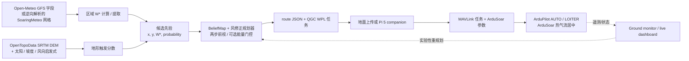

# 主线技术支持性审查

**主线：** weather → planner → companion / ground monitor → MAVLink → ArduPilot / ArduSoar
**审查日期：** 2026-07-28
**审查基线：** `bde3a3f3b5631b32e0e419bac15ee0c119d83fcc`，以及本轮明确列出的即时修复
**判定标签：** 已证实 · 部分证实 · 疑似 AI 幻觉 · 已证伪

## 1. 核心结论

这个仓库包含真实、可执行、可测试的原型代码，并不是凭空编造的项目。离线天气处理、规划器几何计算、风修正可达性、路线序列化、能量门控、地形评分基础函数、BeliefMap 生命周期和重规划变换均有可执行测试。本轮 95 项测试全部通过，其中包括 3 项实时联网集成测试。

目前证据能够支持：

> 系统可以把真实预报/模式输入转换成启发式升力机会分数，再转换成与 ArduPilot 兼容的候选任务。

目前证据不能支持：

> 系统能够预测真实热气流的地理位置，能够安全闭合 weather-to-ArduSoar 链路，或能够在真实飞机上提升续航/越野性能。

最大的缺口不是代码数量，而是数据血缘和独立验证。多处文档把模式网格点、随机样本或地形启发式热点升级描述为“预报热气流位置”。随后，SITL 的 “weather truth” 演示又在规划器自己选出的点上注入模拟升力，因此验证是循环的。本仓库中也没有可复查的 SITL 遥测、DataFlash 日志、Pi 5 台架记录、硬件在环记录或真实飞行日志。

当前总体判定：**部分证实的研究原型；尚未完成飞行验证。**

## 2. 审查范围

本轮覆盖了当前主线及其直接依赖的文档和测试：

- Weather：`weather/*.py`、`weather/README.md`、Open-Meteo 与 SoaringMeteo 实时适配器、terrain prior、缓存与错误处理。
- Planning：`planner/*.py`、`navigation/thermal_prior.py`、能量模型、任务文件生成、vision/replan 路径。
- Companion：`companion/mav.py`、上传/机载/地面监控程序、guided 与 cross-country 变体、Pi 5 文档。
- ArduPilot 交接：QGC WPL 输出、MAVLink mission/command/parameter 协议、ArduSoar 参数文件。
- SITL/dashboard：面向主线的驱动器、实时 dashboard、安装与演示脚本、被声称的验证证据。
- Tests：`tests/` 下全部测试。

已删除的 `goals.md` 和 `proposal.md` 未作为证据，也没有被恢复。

## 3. 实际实现的主线

实线表示已实现的数据路径。虚线表示不完整的实验性反馈路径，不能视为已经验证的自主闭环。

## 4. 本轮产生的运行证据

| 检查 | 结果 | 能证明什么 | 不能证明什么 |
|---|---:|---|---|
| `python -m compileall -q weather planner navigation companion sitl dashboard` | 通过 | Python 语法和不依赖 import 的编译检查 | 可选依赖和硬件运行 |
| `pytest tests -q -m "not integration"` | **92 passed, 3 deselected** | 离线算法与回归测试 | 实时服务、SITL、MAVLink、Pi、飞控 |
| `pytest tests -q -m integration` | **3 passed, 90 deselected** | 2026-07-28 当天 Open-Meteo 与 SoaringMeteo 端点可访问，解析结果在合理范围 | 预报精度或热气流中心位置精度 |
| `pytest tests -q` | **95 passed** | 当前整套测试可通过 | 端到端飞行 |
| `.venv` 依赖探测 | `pymavlink=False`、`dash=False`、`plotly=False` | 当前测试虚拟环境不能直接运行 companion/live dashboard | 根据 requirements 重新安装后是否可运行 |
| WSL/SITL 探测 | 未安装 WSL | 当前电脑现状不能运行 ArduPilot SITL | 其他已配置电脑上的 SITL 表现 |
| 飞行产物搜索 | 无 `.tlog`、`.BIN` 或飞行日志 | 当前仓库没有可重放的飞行证据 | 其他地方是否发生过未留档演示 |
| 硬件证据 | 未提供 | — | 真实 FC、Pi 5 UART、机体、传感器和飞行安全 |
| 参考 PDF 审阅 | AutoSOAR 22 页和 POMDSoar 10 页全文阅读；关键架构、算法、参数及结果页完成人工图像核对 | 两篇论文真实提出的要求和常数 | 本仓库是否已实现或验证这些要求 |

测试是有意义的，但主要为单元级测试。3 项集成测试只证明数据接口可访问并通过合理范围检查。

`docs/` 下两份 PDF 均被当作第一手权威信源并以只读方式核对：

- Depenbusch、Bird 与 Langelaan，*The AutoSOAR autonomous soaring aircraft, part 1: Autonomy algorithms*，Journal of Field Robotics 35 (2018)，868–889，DOI 10.1002/rob.21782。
- Guilliard、Rogahn、Piavis 与 Kolobov，*Autonomous Thermalling as a Partially Observable Markov Decision Process*（POMDSoar）。

## 5. 与两份参考论文的符合性

### 5.1 先区分论文范围

两篇论文处理的是不同层级：

- **AutoSOAR** 是完整机载自主栈：实测机体极曲线、能量/风估计、带均值与方差的动态大气地图、升力特征图和持久 occupancy map、概率滑翔足迹、speed-to-fly、热气流居中，以及 explore/exploit 有限状态机。
- **POMDSoar** 是在“已经检测到热气流”之后使用的战术控制器。它复用 ArduSoar 的热气流 EKF 和进入/退出逻辑，但用约 1 Hz 的 POMDP/MPC 动作选择器替代固定半径居中。检测热气流、决定退出以及越野寻找热气流都不属于该论文范围。
- 本仓库主要是一个**飞前战略天气先验与路线生成器**，战术居中交给 stock ArduSoar。因此，与论文局部相似不能自动构成“实现符合论文”。

### 5.2 AutoSOAR 符合性矩阵

| AutoSOAR 要求 | 仓库证据 | 判定 |
|---|---|---|
| 用飞行数据实测并拟合机体极曲线，再推导转弯下沉率（第 3.1 节，公式 1–2）。 | 存在 `SOAR_POLAR_CD0/B/K` 和固定下沉率假设，但没有保留极曲线实测数据或拟合结果。两份论文都不能证明当前 “Radian-class” 三元组。 | **结构部分证实；数值无支持** |
| 能量状态 UKF、水平/垂直风估计和方差传播（第 3.2.1–3.2.2 节，公式 3–12）。 | 主线中没有对应 UKF、比能状态、动力状态排除或不确定度传播；代码直接使用 `VFR_HUD.climb`。 | **作为 AutoSOAR 实现已证伪** |
| 均匀二维大气均值/方差网格；10 Hz 观测、1 Hz 预测；阵风/传感器/定位方差与 50 m 空间扩散（第 3.3 节，公式 13–15）。 | `companion/ground_monitor.py:48–98` 只是稀疏经纬度字典和恒定噪声标量更新。它只保留公式 13 的大致衰减形式，丢弃低于 0.3 m/s 的全部观测，没有空间定位和上下文门控。 | **仅衰减思想部分证实** |
| 从实测风场均值/方差进行空间卷积后计算升力特征概率（第 3.4.1 节）。 | `navigation/thermal_prior.py:29–40` 直接对 forecast W* 使用固定 `sigma=0.8` 的 Gaussian CDF；没有机载卷积或实测方差场。 | **作为论文特征概率已证伪** |
| 使用机体性能、转弯下沉、实测升力和航行影响计算等效爬升效用（第 3.4.2 节，公式 16–18）。 | `navigation/thermal_prior.py:96–125` 是使用固定 `bank_sink`/`cruise_sink` 的确定性简化分数；强度输入是 forecast W*，不是定位后的实测特征。 | **近似实现部分证实** |
| 独立、跨飞行持久保存的 occupancy map，使用测量概率和加权 log odds 更新（第 3.5 节，公式 19–21）。 | `BeliefMap.confirm/disconfirm` 直接给候选 log odds 加减 `0.0045`/`0.0009`，没有公式 19，也没有跨飞行持久化网格。 | **作为 AutoSOAR occupancy mapping 已证伪** |
| 带地形和概率的滑翔足迹：逐格风传播、粒子、不低于 0.95 的范围概率及净空检查（第 3.6–3.7 节）。 | 规划器可达性只有标量 L/D 和沿航迹风；没有地形相交、粒子不确定度、逐格风或 0.95/0.99 可达概率。 | **已证伪** |
| MacCready 风格 speed selection（第 4.1 节，公式 33–34）。 | 巡航空速是固定值。`navigation/decision.py` 和 `navigation/thermal_map.py` 虽写有 “MacCready-flavoured”，但没有求解论文的选速公式。 | **已证伪** |
| 使用 15–45 秒观测队列和 Allen bell model 完成热气流定位/居中（第 4.3 节）。 | 主线把这一层交给 ArduSoar；活动 Python 路径没有 AutoSOAR 的质心/非线性拟合控制器。 | **未实现；仅外部委托** |
| Explore/exploit FSM、热通量/地表覆盖先验、不确定度—能量 priority 和方向 bias（第 5 节，公式 35–43）。 | 地形分数使用 DEM 坡度、太阳、山脊和风启发式，但缺少反照率、Bowen ratio、land cover、大气不确定度、可用能量和论文 priority/bias 公式。60 秒/20% 重规划是独立的自定义策略。 | **思想部分证实；实现不符合** |
| 80 m 证据距离、40 秒锁定、120 秒阈值下降、20–40 秒窗口及 clearing orbit 的 latch/unlatch（第 5.2 节、表 A2）。 | 主线中不存在对应状态机。stock ArduSoar 有自己的进入/退出行为，但不是 AutoSOAR FSM。 | **已证伪** |

### 5.3 POMDSoar 符合性矩阵

| POMDSoar 要求 | 仓库证据 | 判定 |
|---|---|---|
| 对热气流中心、强度、半径维护 Gaussian belief，并由 EKF 更新。 | `BeliefMap` 是带标量 probability/strength 的稀疏 forecast candidate 列表，不是论文的 thermal-state belief。 | **已证伪** |
| 使用例如 −45° 到 +45° 的离散倾角动作弧，并用拟合后的机体转弯模型评估。 | 主线中没有 action arc 集合、控制器轨迹模型或机体转弯模型拟合。 | **已证伪** |
| 热气流状态协方差 trace 较高时进入 explore，选择使最终预期不确定度最小的动作。 | 没有 covariance-trace 阈值、虚拟观测采样或 explore 优化器。 | **已证伪** |
| 置信度较高时进入 exploit，采样热气流状态并最大化预期积分升力/高度增益。 | 没有热气流 belief 采样或战术动作优化器；战略候选点评分是另一个问题。 | **已证伪** |
| 以约 1 Hz 运行足够快的 receding-horizon 动作选择。 | 没有 POMDSoar runtime，也没有对应 benchmark。 | **已证伪** |
| 复用 ArduSoar EKF 和热气流进入/退出逻辑。 | 交给 stock ArduSoar 的架构与“使用 ArduSoar 作为战术控制器”相容，但 stock ArduSoar 是 POMDSoar 论文里的**基线控制器**，不是 POMDSoar。 | **架构部分证实；不是 POMDSoar** |

全仓搜索没有发现 POMDP 状态、针对 `(thermal x, thermal y, strength, radius)` 的 EKF belief update、covariance-trace 切换、采样动作仿真或 POMDSoar 控制器。因此，任何“本仓库实现了 POMDSoar”的主张均为**已证伪**。

论文中“POMDSoar 在 14 组配对飞行中有 11 组优于 ArduSoar”的结果，仅适用于其修改过的 ArduPlane 3.8.2/Frigatebird、拟合转弯模型、两架 Radian Pro、9 m/s 目标空速和低空测试流程。它不能为本仓库或当前 12 m/s/default polar 设置提供性能证据。

### 5.4 参数和主张迁移审计

| 项目 | 论文实际内容 | 仓库用法 | 分类 |
|---|---|---|---|
| `0.5 × wind` 热气流漂移 | AutoSOAR 表 A1 称其为飞行员启发式。POMDSoar 在短战术时域内假设热气流随风等速移动。 | 对未确认 forecast candidate 持续使用 `0.5 × wind` 漂移。 | **常数部分证实；模型上下文不同** |
| `400 m AGL` | AutoSOAR 表 A2 说明这是针对其机体的启发式最低工作高度。 | 与 `GLOBAL_POSITION_INT.relative_alt` 比较；后者相对 home，并非 terrain AGL。 | **安全解释已证伪** |
| `0.0045/0.0009` | AutoSOAR 把它们作为 measurement-probability log odds 的正/负权重。 | 作为固定增量直接加减 candidate log odds。 | **若称为符合公式 19–21，则属于疑似 AI 幻觉** |
| `30°` 倾角 | AutoSOAR 将其列为 nominal bank；POMDSoar 会在多个候选倾角间选择。 | 作为起始参数，但其他几何/空速数值独立设定。 | **仅起始值部分证实** |
| 预报热气流位置 | AutoSOAR 明确指出，天气模型可给区域概率和平均风，但不能给实时风或精确热气流位置；精确地图依靠机载测量建立。 | 随机位置、模式采样点和地形极大值只是路线候选。 | **若称为真实 thermal-core forecast，则已证伪** |

### 5.5 基于论文的最终判定

- **“主线实现了 AutoSOAR”——已证伪。**
- **“主线实现了 POMDSoar”——已证伪。**
- **“主线包含若干受论文启发的简化战略启发式，并把战术居中交给 ArduSoar”——部分证实。**
- **“两篇论文验证了本仓库飞行性能或参数集”——已证伪。**

最稳妥的设计是明确保持当前边界：weather/terrain 产生带不确定度的战略**机会候选**，锁定版本并经过测试的 ArduSoar 负责战术 thermalling。若要求严格复现论文，AutoSOAR 和 POMDSoar 应分别作为独立实现项目，不能仅在当前启发式周围增加引用。

## 6. 本轮顺手修复的问题

以下均为范围较小、结论确定的缺陷，没有修改尚未验证的飞行策略：

1. 修复 live dashboard 的 MAVLink 读取循环缩进。原先外层无限重连循环导致接收代码永远不可达。
2. 初始化并缓存 Pi 5 的 `alt`、`lat`、`lon` 和 `armed` 状态；写状态时不再从 HEARTBEAT 等无经纬度字段的消息读取 `lat/lon`。
3. 为规划器增加确定的 `--out-prefix` 输出契约，并让 `ground_monitor` 使用它。旧代码期待 `/tmp/ground_replan.json`，规划器却会在目录下写带 tag 的不同文件名。
4. 阻止 `--source terrain --region-km ...` 静默调用 Open-Meteo 后再标记成 `terrain-region`；现在会明确报出该组合尚未实现。
5. `ground_upload` 在 GPS 等待超时后不再错误输出 “GPS fix confirmed”。
6. 将 `pymavlink` 加入 live dashboard requirements。
7. 修正 Pi 5 UART 文档：Pi 5 默认 `/dev/serial0` 指向 UART10/调试接口，并不自动指向 GPIO14/15。
8. 修正 ArduSoar/geofence 参数文件中把相对 HOME 高度写成 terrain AGL 的危险注释。
9. 删除根 README 中已经过期的 “59 passing” 固定测试数量。
10. 新增 2 项回归测试，覆盖确定的重规划输出路径与错误 terrain-region 来源拒绝。
11. 修正夸大的 AutoSOAR 公式/章节注释，并避免 altitude-critical 条件在每条遥测消息上都强制触发重规划；现在只在首次越过占位阈值时触发一次。
12. 重写最容易误导的 weather/planner/dashboard/SITL 文档和演示输出，不再把合成候选、模式采样点和注入的 SITL 升力描述为真实 thermal location 或独立验证。

修改后：编译检查通过，**95 项测试全部通过**，`git diff --check` 通过。

MAVLink runtime 和 live dashboard 的修复目前只完成了**本地语法验证，尚未实时执行**，原因是当前 venv 没有 `pymavlink`/Dash，且当前电脑没有可用 SITL/FC。

## 7. 主张分类

### 7.1 已证实

| 主张 | 证据 |
|---|---|
| Open-Meteo 适配器会读取真实模式字段，并计算 Deardorff 风格的对流速度尺度。 | 源码检查、手算单元测试、实时 API 测试、Deardorff 原始论文。 |
| 当前 SoaringMeteo 端点及逆向解析器能够返回数值合理的二维网格。 | 审查当天两项实时测试通过。 |
| 规划器实现了候选选择、风修正滑翔可达性、两步前视、QGC 输出和可选返航能量门控。 | 源码检查及规划/能量测试通过。 |
| QGC WPL 输出包含 Plane 支持的 TAKEOFF、LOITER_TO_ALT、RTL 等任务命令。 | 序列化测试与 ArduPilot 官方任务命令文档。 |
| ArduPilot/ArduSoar 支持 `SOAR_ENABLE`、极曲线参数、高度控制、RC option 88、检测升力后自动 LOITER 和热气流居中。 | ArduPilot 官方文档、ArduSoar 论文/源码。 |
| 离线的 belief drift/decay/confirm/disconfirm 和 replan 变换可以执行。 | lifecycle/replan/vision 测试通过。 |
| 第 6 节的小修复没有破坏现有测试套件。 | 修改后 95/95 通过。 |

这里的“已证实”仅表示实现事实或协议事实有证据，不代表算法已经具备经飞行验证的性能。

### 7.2 部分证实

| 主张 | 已支持部分 | 缺失证据或限制 |
|---|---|---|
| “真实天气驱动路线。” | 输入气象字段来自真实预报/数值模式产品。 | 本地候选坐标可能是随机生成；区域点是模式采样点，不是观测到的热气流中心。 |
| Open-Meteo W* 表示可用升力。 | 公式是可识别的边界层速度尺度。 | 使用简化干空气近似，未与飞机实测升力标定；W* 是区域尺度，不是点热气流预测。 |
| SoaringMeteo 提供预报升力。 | 当前能够读取实时且数值合理的数据。 | 字段结构来自对网页应用的逆向解析；仓库没有带版本的官方 API/schema 契约。 |
| Terrain prior 能预测触发位置。 | 使用了真实 SRTM、高度、太阳几何、坡度、山脊和迎风项。 | 系数、阈值、概率映射、强度缩放和 60 秒漂移均未标定。 |
| 规划路线在滑翔范围内。 | 几何滑翔和风修正有单元测试。 | 第一段高度可能高估；未整合地形、不确定性、空域、累计电量和真实机体性能。 |
| 规划器使用 AutoSOAR 风格的升力效用和 Gaussian 升力概率。 | AutoSOAR 第 3.4.1/3.4.2 节确实使用卷积后的 Gaussian CDF 和等效能量/爬升率公式。 | 本代码把固定 `sigma=0.8` 直接作用于预报 W*，并简化公式 16–18；没有复现 AutoSOAR 的实测风场、卷积、方差传播和随机安全评估。 |
| 能量规划能防止无法返航。 | 存在返航能量门控并有测试。 | 功能默认可关闭，且不会逐段扣除累计能量；ground monitor 重规划也不继承能量状态。 |
| Companion 可以上传和控制任务。 | 实现了相应协议消息与任务项。 | 本轮没有 SITL/FC 实跑；命令/参数结果确认和任务状态机不完整。 |
| `VFR_HUD.climb` 可以用于大气图。 | ArduPilot 官方说明，soaring active 时该字段会变成估计的气团垂直速度。 | 其他状态下它仍是飞机爬升率；monitor 没有按模式/电机状态过滤。 |
| Live dashboard 是实时遥测界面。 | 不可达读取循环已修复，文件可编译。 | 本地缺依赖且未实时测试；线程在 import 时启动，重规划后路线 overlay 不会刷新。 |
| 参数文件可以作为起点。 | 参数名、部分公式和默认概念与官方文档一致。 | 固件版本未锁定，机体极曲线和空速没有实测。 |

### 7.3 疑似 AI 幻觉

下列内容具有“听起来技术正确”的形式，但没有匹配推导/标定，或夸大了所引用论文的实现：

1. 早期 `ground_monitor` 文案把 60 秒 route evaluation 和 20% upload threshold 归因于 AutoSOAR 第 5.1 节。该节实际定义的是 biased exploration priority `Q_ij`；论文中没有 `1.20` 或周期性替换任务。文案已经修正，但该策略本身仍是未经验证的自定义逻辑。
2. `AtmoMap` 声称实现 AutoSOAR 公式 13–15。公式 13 确实支持指数衰减和独立标量 Kalman filter，但公式 14–15 的 measurement variance 来自估计器质量、阵风方差和空间定位。仓库改成固定 `R=0.5`、`Q_rate=0.01`、只更新一个 cell，并丢弃负观测。
3. `BeliefMap` 的 `0.0045` 和 `0.0009` 的确出现在 AutoSOAR 公式 21，但代码把这两个常数直接加到候选 log odds。论文则用它们加权由观测计算出的升力概率 log odds。把当前捷径称为 “Bayesian” 没有得到支持。
4. 地形到热气流公式中的 `a_ridge=0.6`、`b_wind=0.5`、`0.25*smax`、概率 `0.3+0.6*score`、强度 `0.4+0.6*score` 是物理上看似合理的启发式，不是有信源的预测模型。
5. 参数文件声称 `SOAR_POLAR_CD0/B/K` 是来自 ArduPilot 文档的 “Radian-class” 数值。官方只提供 K 公式和调参方法，没有为该机体三元组提供证据。
6. README 中没有原始日志、版本、随机种子、遥测或可重复验收脚本支撑的精确性能故事。

论文确实明确给出了 **400 m AGL** 最低工作高度和 **0.5 × wind** 热气流漂移启发式。这两个数字本身不是幻觉；仓库的问题是把前者用于相对 HOME 的遥测字段，并把两者当作普遍有效的标定值。

这些内容应保持为假设或初始调参值，直到能追溯到正式信源或用保留的数据完成标定。

### 7.4 已证伪

| 主张 | 已证伪原因 |
|---|---|
| Local-box 候选坐标是“预报热气流位置”。 | 代码在边界内随机采样坐标；天气只提供整体强度/数量/风，不提供这些位置。 |
| 对 Open-Meteo 区域进行更密集采样会产生更高分辨率的真实 W* 信息。 | GFS 有原生网格；增加请求坐标只会得到更密的 API 样本/选格，不会产生新的大气分辨率。代码还保存请求坐标而不是返回/模式坐标。 |
| 一个区域 W* 网格点就是一个真实热气流中心。 | W* 是网格尺度的对流速度量，不会识别该经纬度上的离散热气流中心。 |
| Weather-truth SITL 演示验证了热点预报精度或“3/3 real lift”。 | 演示把模拟热气流写在规划器自己的路线位置上；命中被注入升力只能验证集成，不能独立验证预报。 |
| Simulation dashboard 使用真实天气且 “no cheat”。 | 世界仍是合成的，并可能使用同一份 prior 作为环境输入和评估对象，没有独立大气真值。 |
| `SOAR_ALT_*`、`FENCE_ALT_MAX` 或 `GLOBAL_POSITION_INT.relative_alt` 是 terrain AGL。 | ArduPilot 把 relative altitude 定义为相对 HOME/ORIGIN；terrain AGL 是另一种 frame/数据路径。错误注释已修正。 |
| Pi 5 从 TCP SITL 切换到硬件时唯一变化是 `--conn`。 | 还需要处理 Pi 5 UART 路由、console 占用、3.3 V 接线、波特率稳定性、供电、FC 串口参数、依赖、权限和台架验证。 |
| 修复前 ground-monitor 重规划会生成它随后读取的文件。 | 它传入了缩写的 `--out-dir`，却按 prefix 文件读取；本轮已修复该契约。 |
| 修复前 live dashboard 连接后会读取遥测。 | stream request/receive 代码位于无限外层循环之外，实际不可达；本轮已修复。 |

## 8. 分层技术发现

### 8.1 Weather 与数据血缘

- `openmeteo_thermal.compute_wstar` 在科学上可识别，但使用近地面温度、显热通量、气压和边界层高度进行简化干空气计算。它应被命名为**对流速度尺度估计**，不能直接称作实测热气流上升速度。
- `openmeteo_prior.py`、`processor.py` 和本地 SoaringMeteo prior 随机放置候选点。每个输出字段应明确记录 `position_source: synthetic_random`、随机种子、模式/run ID、原生网格分辨率、请求坐标和返回/模式坐标。
- 区域 Open-Meteo 输出刻意保留请求坐标。使用 land-cell selection 和小于原生网格的采样间隔时，这会歪曲服务器实际选择的模式格点位置。
- SoaringMeteo fallback 会捕获宽泛异常、静默尝试旧 run，并可能漏掉 block。每份产物都应记录最终 run、失败 run、schema fingerprint、缺失格点数量和解析器版本。
- Terrain mode 使用真实 DEM，但把缺失高程设为 `0.0`，可能制造虚假地形梯度。应屏蔽或作废缺失区域候选。
- 当 `n=24` 为偶数时，用 `n//2` 作为 ENU 中心会产生半格偏移。应使用真实请求原点或插值网格中心。
- 本轮已通过明确拒绝来修复 terrain-region 的来源错标。

### 8.2 Planner、Belief、Energy 与 Replan

- Route scorer 和风修正已经实现并通过单测。其等效爬升率结构可识别地来自 AutoSOAR 公式 16–18/27，但只是确定性简化，不是论文完整的风场与随机安全评估。
- 可达性对每一段都使用完整 thermal ceiling，包括第一段。如果飞机起点低于该高度，第一段可达集合会过度乐观。
- 默认目标是 `probability × strength` 最大的候选点；只有提供 `--goal-lat/--goal-lon` 时才有外部越野目的地。
- 能量门控在每个位置都用同一个初始电量判断能否电机返航，没有累计扣除前面航段、电器负载、reserve 变化和不确定性。
- `prob_gaussian` 借用了 AutoSOAR 的 Gaussian-CDF 思路，但 AutoSOAR 是在机载 mean/variance 风场完成空间卷积后使用；这里直接用于预报 W* 并固定 `sigma=0.8`，因此不是该坐标存在离散热气流的概率。
- AutoSOAR 的 `0.0045/0.0009` occupancy 权重是真实的，但 `confirm/disconfirm` 省略了公式 19–21 中由观测计算概率的部分，因此很小的固定 log-odds 增量并不是忠实的 occupancy update。
- `replan.py` 使用固定高度假设，在重建 prior 时丢失风，不保留原目标/能量状态，并且和 `BeliefMap` 使用不同更新规则。
- `vision_link.watch` 每次报告都重新载入原始 prior，连续观测不会累积成持久 posterior。
- Pi status JSON 是 dashboard snapshot，并不是 replan 接收的 observation report schema，因此文档中的反馈闭环实际上没有接通。
- QGC 任务使用相对 HOME 的 `MAV_FRAME_GLOBAL_RELATIVE_ALT`。Terrain following 需要 terrain frame 和有效 terrain data；把数值称为 AGL 不会改变协议语义。

### 8.3 Companion、MAVLink 与 Ground Monitor

- 任务上传没有完整实现健壮的 MAVLink mission 状态机：缺少 target/mission-type 检查、安全 seq 边界检查、标准 timeout/retry，以及对提前收到的 `MISSION_ACK` 的正确复用。QGC parser 还会丢弃文件中的 `current`/`autocontinue`，却声称 verbatim upload。
- `set_param`、`set_soaring_switch` 和 `set_mode` 发送了修改，但不能证明车辆最终状态。MAVLink command 需要匹配 `COMMAND_ACK`；参数需要读取当前值验证，尤其 ArduPilot 还有已记录的协议差异。
- `ground_upload` 已经正确处理 GPS 等待结果，但 Pi 的 bench-arm 路径仍忽略该 Boolean 返回值，应改成失败关闭。
- 飞行中自动替换 mission 并调用 `MISSION_SET_CURRENT(1)` 尚未验证飞机位置、活动模式、任务拒绝、链路丢失或回滚。硬件上应保持禁用，直到 fault-injection SITL 通过。
- `AtmoMap` 只实现了 AutoSOAR 公式 13 的大体形式，省略公式 14–15 的 measurement-noise/localization 模型，并丢弃所有负值/弱值，因此无法学习下沉区域。应接收带上下文标签的观测，并区分气团估计和有动力/普通飞机爬升率。
- AutoSOAR Table A2 的 400 m 阈值明确是 **AGL**，且是针对该飞机的启发式。Monitor 却与相对 HOME 高度比较，因此引用不能验证当前安全触发逻辑。
- 重规划只从当前经纬度开始，但丢失原始战略目标、route revision、当前高度语义、电池状态和不确定性；`alt` 目前只用于日志。
- Dashboard/status 文件非原子写入，读取器会吞掉所有错误。应使用临时文件 + atomic replace，并增加 schema/version 和明显的 stale/error 状态。
- 修复后的 Pi runtime 仍会在未收到 aux command ACK 时立即标记 soaring enabled；硬件使用前必须修正。

### 8.4 ArduSoar、参数与安全

- ArduSoar 本身有官方文档、源码和公开飞行论文支持。当前不确定的是仓库集成与调参，而不是 ArduSoar 是否真实存在。
- 应锁定 ArduPilot release/commit，并保存该版本参数 metadata。当前 setup 会 shallow-clone 未锁定的移动分支，并容忍部分 prerequisite/patch 失败。
- 必须实测机体极曲线和空速，不能把示例 CD0/B/K 当作可直接飞行的数据。
- 所有安全逻辑都应使用明确 altitude frame。相对 HOME ceiling 在上升地形上可能违反 AGL 限制，在下降地形上也无法保证离地净空。
- 启用自主上传前，必须通过 geofence、RC loss、电池 failsafe、pilot override、command/mission reject 测试。
- 因为真实 FC 和 Pi 5 尚未测试，当前没有证据支持真实飞机安全行为主张。

### 8.5 SITL 与验证

- SITL 脚本展示了合理的 connect/upload/command/monitor 架构，但本电脑缺少 WSL/ArduPilot，无法执行。
- 环境不可复现：ArduPilot 未锁版本，部分错误被忽略，thermal patch 失败可能只警告，脚本还可能选择旧的 “latest” route。
- Weather-truth SITL 是有意的循环验证。应改为由 forecast/planner 之外的独立过程生成隐藏 truth field，然后在多随机种子下测量 detection rate、false-positive rate、route completion、altitude margin、motor energy 和 return-home success。
- 每次运行都应保留机器可读产物：代码 commit、ArduPilot 版本、参数、seed、prior、route、`.tlog`、DataFlash `.BIN`、stdout 和汇总指标。

## 9. 升级主线所需工作

### P0 — 安全与协议正确性

1. 锁定 ArduPilot、pymavlink、Python 依赖、setup 脚本和 thermal patch。
2. 实现并测试可靠的 command/parameter/mission ACK、重试、拒绝和链路丢失路径。
3. 把每个模糊高度替换为明确 frame，并增加 terrain/airspace 验证。
4. 在 fault-injection SITL 通过前，默认关闭飞行中自动重规划/上传。
5. 使用保留日志完成 Pi 5 UART、真实 FC 链路、mission upload、模式控制、pilot override 和 failsafe 台架测试。

### P1 — 数据血缘与算法诚实性

1. 为每个 candidate/route 增加 source、run、原生分辨率、请求/模式坐标、变换方式、seed 和 heuristic version。
2. 重命名随机候选和区域 W* 点，不能再把二者表示为观测到或预测出的 thermal core。
3. 在连续观测间持久保存一个 belief state，并统一 BeliefMap、replan、Pi status 和 ground monitor 的更新规则。
4. 在重规划中传递 goal、current altitude、wind、battery、累计能量、route revision 和 uncertainty。
5. 把论文公式与项目启发式分开；每个常数都必须有引用，否则标记 `UNVALIDATED_TUNING`。

### P2 — 独立验证

1. 建立非循环 SITL truth 和可重复的批量评估器。
2. 增加 mock MAVLink 状态机测试和真实 ArduPilot SITL 验收测试。
3. 用留出的观测升力验证 forecast/terrain score，并纳入负观测。
4. 完成硬件在环和有约束台架测试。
5. 只有安全门槛通过后才进行有人监督的真实飞行；保留原始日志并预先定义成功标准。

## 10. 最低验收证据

在以下证据齐备前，不应把主线称为端到端 technically supported：

- 可复现环境清单和锁定版本的 ArduPilot build。
- unit、integration、MAVLink fault-injection 和 SITL batch 测试全部通过。
- 模拟中使用独立 truth；规划输出不能同时决定被评估的 truth。
- 记录 mission/command/parameter ACK 和拒绝处理。
- 已验证的 altitude frame、terrain 和 airspace 检查。
- Pi 5 + 真实 FC 台架证据。
- 每次验收运行至少保留对应 `.tlog` 和 DataFlash `.BIN`。
- 留出数据对比，证明 forecast/terrain score 是否优于 baseline 地预测观测升力。
- 真实机体的极曲线、空速、功耗、reserve 和 failsafe 测量。
- 在声称续航或自主越野能力前提供有人监督的真实飞行证据。

## 11. 使用的权威信源

- [Open-Meteo GFS API 官方文档](https://open-meteo.com/en/docs/gfs-api)
- [OpenTopoData SRTM 数据/API 文档](https://www.opentopodata.org/datasets/srtm/)
- [Deardorff：Convective Velocity and Temperature Scales（1970）](https://journals.ametsoc.org/view/journals/atsc/27/8/1520-0469_1970_027_1211_cvatsf_2_0_co_2.xml)
- [MAVLink Mission Protocol](https://mavlink.io/en/services/mission.html)
- [MAVLink Command Protocol](https://mavlink.io/en/services/command.html)
- [MAVLink Parameter Protocol](https://mavlink.io/en/services/parameter.html)
- [ArduPilot Plane Mission Commands](https://ardupilot.org/plane/docs/common-mavlink-mission-command-messages-mav_cmd.html)
- [ArduPilot Understanding Altitude](https://ardupilot.org/plane/docs/common-understanding-altitude.html)
- [ArduPilot Soaring 官方文档](https://ardupilot.org/plane/docs/soaring.html)
- [Tabor 等：ArduSoar 论文](https://arxiv.org/abs/1802.08215)
- [AutoSOAR 论文 DOI](https://doi.org/10.1002/rob.21782)
- [项目内 AutoSOAR PDF](<../docs/Journal of Field Robotics - 2018 - Depenbusch - The AutoSOAR autonomous soaring aircraft  part 1  Autonomy algorithms.pdf>)
- [项目内 POMDSoar PDF](<../docs/p68(1).pdf>)
- [POMDSoar 扩展论文](https://arxiv.org/abs/1805.09875)
- [Energy-Based Long-Range Path Planning 论文 DOI](https://doi.org/10.2514/1.52738)
- [Raspberry Pi UART 官方配置文档](https://www.raspberrypi.com/documentation/computers/configuration.html)

## 12. 最终判定

**天气获取和离线规划原型在单元/集成层面已获得技术支持。** 对于本地随机候选，“能够预测真实 thermal location”的语义主张已经被证伪；对模式网格/地形候选，这一主张也尚未获得支持。**Companion-to-ArduSoar 运行链路仅部分证实**，必须继续视为实验功能。**真实飞机的安全与性能主张尚未验证。**

建议对外使用以下表述：

> “本仓库是一个研究原型，它把预报和地形特征转换成启发式滑翔路线候选，并导出 ArduPilot 任务。离线算法和实时天气适配器已有测试；热气流位置预测能力、闭环 SITL 稳健性、硬件集成和真实飞行性能仍有待验证。”
