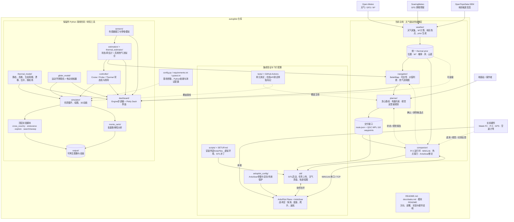

# ArduSoar 项目结构图

> 本图按“当前主线、验证工具、保留的基线仿真”分层。图中节点和连线均为 Mermaid 文本，可直接修改。

## 阅读方式

- 实线表示主要数据或控制流；虚线表示反馈、装载、配置或测试关系。
- `weather → prior → navigation/planner → route → companion → ArduSoar` 是当前项目主线。
- `glider_model / thermal_model / controller / simulator` 是仍可运行的研究基线，不是实机内环飞控。
- ArduPilot 本体不在本仓库内；安装脚本把它放在仓库同级目录，SITL 与实机共同复用 MAVLink 接口。
